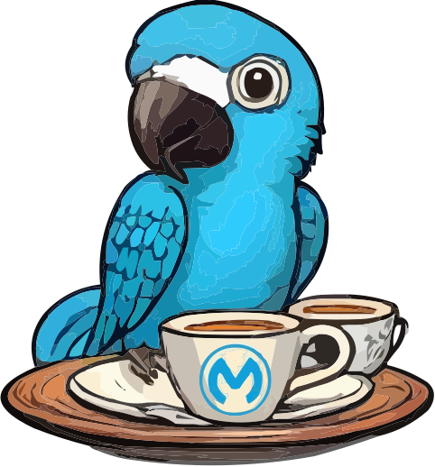

# MuleSoft AI Chain Connector


##    [MuleSoft AI Chain Connector](https://mac-project.ai/docs/mulechain-ai)

MuleSoft AI Chain is a MuleSoft custom connector (𝘣𝘢𝘴𝘦𝘥 on 𝘓𝘢𝘯𝘨𝘊𝘩𝘢𝘪𝘯4𝘫) to provide a complete framework for MuleSoft users to design, build, and manage the lifecycle of AI Agents fully in the Anypoint Platform. It is part of the MuleSoft AI Chain Project (aka MAC Project) with the overall goal to provide capabilities, examples, etc. for MuleSoft Developers.

### Requirements

- The maximum supported version for Java SDK is JDK 17. You can use JDK 17 only for running your application.
- Compilation with Java SDK must be done with JDK 8.

### Installation

To use this connector, add the following dependency to your application's `pom.xml` as follows:

```xml
<dependency>
   <groupId>com.mulesoft.connectors</groupId>
   <artifactId>mule4-aichain-connector</artifactId>
   <version>{version}</version>
   <classifier>mule-plugin</classifier>
</dependency>
```

### Documentation
- Check out the complete documentation on [mac-project.ai](https://mac-project.ai/docs/mulechain-ai).
- Learn from the [Getting Started YouTube Playlist](https://www.youtube.com/playlist?list=PLnuJGpEBF6ZAV1JfID1SRKN6OmGORvgv6)

---

### Stay tuned!

- 🌐 **Website**: [mac-project.ai](https://mac-project.ai)
- 📺 **YouTube**: [@MuleSoft-MAC-Project](https://www.youtube.com/@MuleSoft-MAC-Project)
- 💼 **LinkedIn**: [MAC Project Group](https://lnkd.in/gW3eZrbF)
