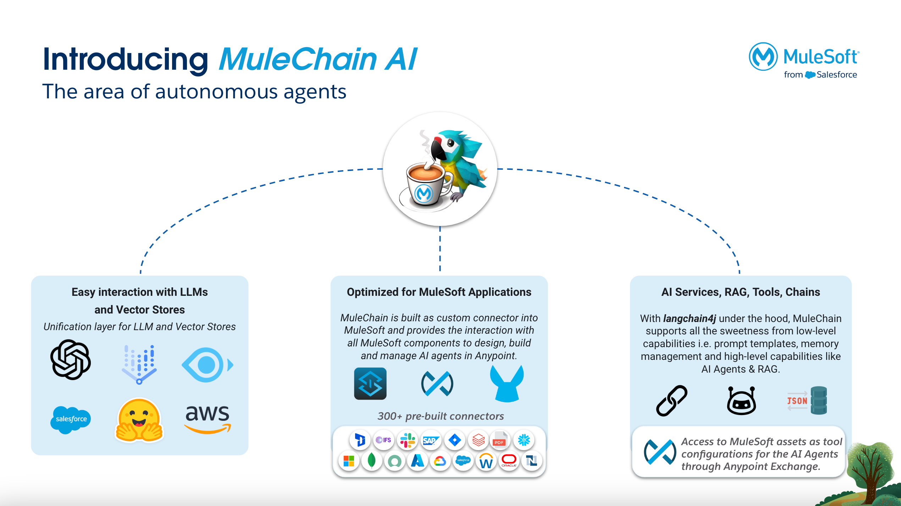
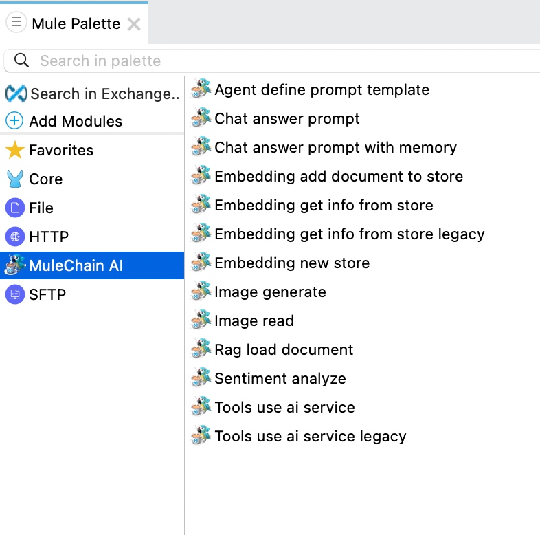

# MuleChain AI Connector for MuleSoft

Langchain4J is used as the base framework for this extension, which integrates Langchain4j capabilities into MuleSoft Anypoint Platform.

𝘐𝘯𝘴𝘱𝘪𝘳𝘦𝘥 𝘣𝘺 𝘓𝘢𝘯𝘨𝘊𝘩𝘢𝘪𝘯4𝘫, Dmytro Liubarskyi, and Lize Raes, we are launching an open-source project for MuleSoft called 𝑴𝒖𝒍𝒆𝑪𝒉𝒂𝒊𝒏. 

## Overview

 🚩 **𝐖𝐡𝐚𝐭 𝐢𝐬 𝐌𝐮𝐥𝐞𝐂𝐡𝐚𝐢𝐧 AI Connector?**

MuleChain AI is a MuleSoft custom connector (𝘣𝘢𝘴𝘦𝘥 on 𝘓𝘢𝘯𝘨𝘊𝘩𝘢𝘪𝘯4𝘫) to provide a complete framework for MuleSoft users to design, build, and manage the lifecycle of AI Agents fully in the Anypoint Platform. It is part of the MuleChain Project with the overall goal to provide capabilities, examples, etc. for MuleSoft Developers.

📌 **𝐂𝐨𝐦𝐩𝐨𝐧𝐞𝐧𝐭𝐬 𝐨𝐟 𝐌𝐮𝐥𝐞𝐂𝐡𝐚𝐢𝐧**
Enabled through LangChain4j, MuleChain will provide:

✅ 𝘌𝘢𝘴𝘪𝘦𝘳 𝘪𝘯𝘵𝘦𝘳𝘢𝘤𝘵𝘪𝘰𝘯 𝘸𝘪𝘵𝘩 𝘓𝘓𝘔𝘴 𝘢𝘯𝘥 𝘝𝘦𝘤𝘵𝘰𝘳 𝘚𝘵𝘰𝘳𝘦𝘴, 

✅ 𝘖𝘱𝘵𝘪𝘮𝘪𝘻𝘦𝘥 𝘜𝘴𝘢𝘨𝘦 𝘪𝘯 𝘔𝘶𝘭𝘦𝘚𝘰𝘧𝘵 𝘈𝘱𝘱𝘴, 

✅ 𝘈𝘤𝘤𝘦𝘴𝘴 𝘵𝘰 𝘈𝘐 𝘚𝘦𝘳𝘷𝘪𝘤𝘦𝘴, 𝘙𝘈𝘎, 𝘛𝘰𝘰𝘭𝘴, 𝘊𝘩𝘢𝘪𝘯, 𝘦𝘵𝘤.


🔀**𝐖𝐡𝐚𝐭 𝐝𝐢𝐝 𝐰𝐞 𝐚𝐝𝐝 𝐨𝐧 𝐭𝐨𝐩 𝐨𝐟 𝐋𝐚𝐧𝐠𝐂𝐡𝐚𝐢𝐧4𝐣?**

MuleChain leverages the MuleSoft ecosystem to provide additional capabilities on top of the great LangChain4j project. 

✅ Dynamic tooling through a configuration file

✅ Flexible tooling through Anypoint Exchange

**Through MuleSoft Anypoint Platform**, we enabled:

✅ E2E Lifecycle Management for AI Agents

✅ Centralized design of AI Agents (Anypoint Design Center)

✅ AI Agent Portal (Exchange & Anypoint Experience Hub)

✅ Fully fledged AI Agent Monitoring (Anypoint Monitoring & Visualizer)

✅ Low Code IDE (Anypoint Studio & Anypoint Code Builder)

✅ Unit-testing framework (MUnit, currently only in Studio)


🔐 **𝐖𝐡𝐞𝐧 𝐰𝐢𝐥𝐥 𝐌𝐮𝐥𝐞𝐂𝐡𝐚𝐢𝐧 𝐛𝐞 𝐚𝐯𝐚𝐢𝐥𝐚𝐛𝐥𝐞 𝐭𝐨 𝐭𝐡𝐞 𝐌𝐮𝐥𝐞𝐒𝐨𝐟𝐭 𝐂𝐨𝐦𝐦𝐮𝐧𝐢𝐭𝐲?**

We are targeting the end of June / beginning of July to release MuleChain as an open-source project on GitHub. It will be available on my GitHub account: https://lnkd.in/erFX3HeY. 


 👻 **𝐂𝐨𝐧𝐭𝐫𝐢𝐛𝐮𝐭𝐨𝐫𝐬**

Who are the contributors: 
- Jeroen Reizevoort (advisor), 

- Prashant Choudhary (advisor), 


- Ajay Rana (developer), 

- Mihael Bosnjak (devops engineer), 

- Vibhor Sharma (developer),

- Damian Scherrer (developer)

- Philipp Schöne (advisor)

- and Amir Khan (advisor & developer)

If you want to become a contributor for MuleChain AI Connector, you have to wait until the project is publicly available on GitHub by the end of June. 

🎥 **𝐖𝐚𝐭𝐜𝐡 𝐨𝐮𝐭 𝐟𝐨𝐫 𝐦𝐨𝐫𝐞 𝐝𝐞𝐦𝐨𝐬**

We will provide more demos in the coming days, so watch out. You can also subscribe to the **YouTube** playlist: https://www.youtube.com/watch?v=NeUIduqZLeY&list=PLnuJGpEBF6ZAvWcGm8uwcIkuElVrUaH7l

Also checkout our **YouTube Channel**: https://www.youtube.com/@MuleChainProject

**𝘚𝘶𝘣𝘴𝘤𝘳𝘪𝘣𝘦 𝘵𝘰 𝘵𝘩𝘪𝘴 LinkedIn 𝘨𝘳𝘰𝘶𝘱, 𝘪𝘧 𝘺𝘰𝘶 𝘸𝘢𝘯𝘵 𝘵𝘰 𝘭𝘦𝘢𝘳𝘯 𝘮𝘰𝘳𝘦 𝘢𝘣𝘰𝘶𝘵 𝘔𝘶𝘭𝘦𝘊𝘩𝘢𝘪𝘯**: https://lnkd.in/gW3eZrbF


This project extends the Mule Palette with a MuleChain adapter, allowing users to leverage advanced natural language processing and AI features within MuleSoft flows.

### Base Framework



### Mule Palette Extension



## Features

- **Language Models**: Integrate various language models provided by Langchain to generate text, perform language analysis, and handle complex language-based tasks.
- **Embeddings**: Utilize embedding models to transform text into numerical vectors for tasks such as text similarity, clustering, and search functionalities.
- **Tools Integration**: Incorporate APIs and other dynamic functionalities into MuleSoft, facilitating the use of external services and data processing tools.
- **Image Models**: Work with image models for tasks like image generation, recognition, and manipulation.
- **Streaming**: Support for real-time data processing and interaction with language models.

## Requirements

- The maximum supported version for Java SDK is JDK 17. You can use JDK 17 only for running your application.
- Compilation with Java SDK must be done with JDK 8.

## Installation

To use this connector, add the following dependency to your application's `pom.xml`:

```xml
<dependency>
   <groupId>com.mule.mulechain</groupId>
   <artifactId>mulechain-ai-connector</artifactId>
   <version>{version}</version>
   <classifier>mule-plugin</classifier>
</dependency>
```

## Getting Started

1.**Clone the Repository**:

```bash
git clone https://github.com/yourusername/langchain4mule.git
cd langchain4mule
```

2. **Set Up Your Development Environment**:

Ensure you have the necessary tools installed, such as JDK 8 and Maven.

3. **Build the Project**:

```bash
mvn clean install
```

## Usage

### Example Mule Flow

Here's an example of how to use the Langchain connector in a Mule flow:

```xml
	<flow name="Jira-AI-Summary-Sentiments" doc:id="ecbe99eb-d390-45b0-ab06-802e7c6dc52d" >
		<jira:on-updated-issue-trigger doc:name="On new and updated issue trigger" doc:id="005a3180-c483-48ad-aaac-04cb45dd1895" config-ref="Jira_Connector_Config" startDate="2024-05-30" projectIdOrKey="ED" issueType="bug">
			<scheduling-strategy >
				<fixed-frequency />
			</scheduling-strategy>
		</jira:on-updated-issue-trigger>
		<set-variable value="#[payload.key]" doc:name="Jira Key" doc:id="3a312f7e-a1ef-4f2b-9448-4d2f45d2a250" variableName="key"/>
		<set-variable value="#[payload]" doc:name="Changed Issue" doc:id="2d0967e3-561f-48f9-b4ce-c09ca2bea72c" variableName="payload"/>
		<os:retrieve doc:name="Retrieve Jira id" doc:id="9865c167-0787-46e5-bad2-67af76d4a069" key="#[vars.key]" objectStore="Object_store">
			<os:default-value ><![CDATA[not_synched]]></os:default-value>
		</os:retrieve>
		<logger level="INFO" doc:name="Logger" doc:id="61981f7d-f242-43ae-8201-0e4b5efcc22c" message="#[payload]"/>
		<choice doc:name="Choice" doc:id="844f6743-fcfa-4eee-a3ef-2dafd0ae8048" >
			<when expression='#[payload=="not_synched"]'>
				<os:store doc:name="Store Jira Id" doc:id="1bff40c1-09eb-4f7f-a574-95909873c947" key="#[vars.key]" objectStore="Object_store">
					<os:value ><![CDATA[#["synched"]]]></os:value>
				</os:store>
				<logger level="INFO" doc:name="Logger" doc:id="cf283a04-9b99-439b-9da2-adc43ea78218" message="#[payload]"/>
				<jira:get-rest-api3-issue-comment-by-issue-id-or-key doc:name="Get Comments" doc:id="3c57ae28-ba40-4e4d-bc49-d58576567ad2" config-ref="Jira_Connector_Config" issueIdOrKey="#[vars.key]" />
				<ee:transform doc:name="extract all comment bodies" doc:id="8f725d76-eba2-4a93-81a3-73968b4c4b64">
					<ee:message>
						<ee:set-payload><![CDATA[%dw 2.0
output application/json
---

{
	comments: payload.comments..body..content..content..text
}]]></ee:set-payload>
					</ee:message>
				</ee:transform>
				<ee:transform doc:name="Transform Message" doc:id="2f629133-723a-4d20-b275-115a28513fa6">
			<ee:message>
				<ee:set-payload><![CDATA[%dw 2.0
output application/java
---

write(payload, "application/json")]]></ee:set-payload>
			</ee:message>
		</ee:transform>
				<scatter-gather doc:name="Scatter-Gather" doc:id="8be657af-4236-4888-8c72-419c43148784">
			<route>
						<mulechain:agent-define-prompt-template doc:name="Agent define prompt template" doc:id="1d2bbd4f-3853-446f-9cf2-80f7f36a59d3" config-ref="DemoKeyLangchain4j" template="You are a support representative who is tasked with creating a short summary of a case that happened between a customer and a company support rep. " instructions="Follow the instructions precisely, do not add any information not provided. Summarize in 1 sentence, and use clear, concise, and straightforward language using the active voice and strictly avoiding the use of filler words and phrases and redundant language. Guide the next steps as maximum 2 bullet points. Keep the emotion of the summary relaxed." dataset='#["dataset: " ++ payload]'/>
			</route>
			<route>
						<mulechain:sentiment-analyze doc:name="Sentiment analyze" doc:id="4c29c266-80d0-42df-9208-7003e8bbff26" config-ref="DemoKeyLangchain4j" data="#[payload]"/>
			</route>
		</scatter-gather>
				<ee:transform doc:name="Transform Message" doc:id="e212a9c0-c8d7-46d1-8ac6-c1666544548c">
			<ee:message>
				<ee:set-payload><![CDATA[%dw 2.0
output application/json
---

{

    "fields": {
    "customfield_10050": {
          "type": "doc",
          "version": 1,
          "content": [
            {
              "type": "paragraph",
              "content": [
                {
                  "type": "text",
                  "text": payload."0".payload
               }
              ]
            }
          ]
        },
    "customfield_10051": payload."1".payload
    
    }
}]]></ee:set-payload>
			</ee:message>
		</ee:transform>
				<jira:update-rest-api3-issue-by-issue-id-or-key doc:name="Edit Issue" doc:id="36f26b7e-f52a-486e-bb97-6de89af232bf" config-ref="Jira_Connector_Config" issueIdOrKey="#[vars.key]" />
			</when>
			<otherwise >
				<os:remove doc:name="Remove" doc:id="3f298f08-c02f-471a-b76b-de25a562993b" key="#[vars.key]" objectStore="Object_store"/>
				<logger level="INFO" doc:name="Logger" doc:id="dd7e5a5e-a10b-45c2-a77f-660a9fbfa10d" message='#["Issue already synched: " ++ vars.key]' />
			</otherwise>
		</choice>
	</flow>

```

## Contributing

We welcome contributions to enhance the functionality and features of this connector. Please follow these steps to contribute:

1. **Fork the Repository**:

   Create your own fork of the repository by clicking the "Fork" button at the top right corner of the repository page.

2. **Clone Your Fork**: Clone your forked repository to your local machine.
   ```bash
   git clone https://github.com/yourusername/mulechain-ai-connector.git
   cd mulechain-ai-connector
   ```
3. **Create a Branch**:

   Create a new branch for your feature or bug fix.

   ```bash
   git checkout -b feature/your-feature-name
   ```

4. **Make your changes**:

   Implement your changes and commit them with a descriptive commit message.

   ```bash
   git add .
   git commit -m "Add your commit message here"
   ```

5. **Push your changes**:

   Push your changes to your forked repository.

   ```bash
   git push origin feature/your-feature-name
   ```

6. **Create a Pull Request**:

   - Go to your forked repository on GitHub.
   - Click the "Compare & pull request" button next to your newly pushed branch.
     Ensure the base fork is **MuleChain-Project/mulechain-ai-connector** and the base branch is develop.
   - Provide a clear and descriptive title and description for your pull request, explaining what changes you made and why.
   - Submit the pull request.

7. **Review Process**:

   Your pull request will be reviewed by the maintainers. You might be asked to make additional changes or provide further explanations.
   Once your pull request is approved, it will be merged into the develop branch.

## License

This project is licensed under the MIT License. See the [LICENSE](LICENSE) file for details.

## Contact

For any questions or support, please open an issue on GitHub.
