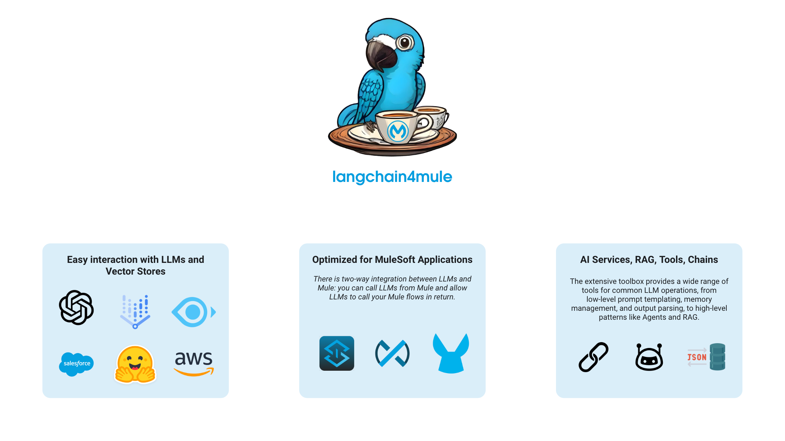

# Langchain Extension for MuleSoft

Langchain4J is used as base framework


...


...


Add this dependency to your application pom.xml

```
<dependency>
<groupId>com.mule.langchain</groupId>
<artifactId>langchain-connector</artifactId>
<version>0.1.0</version>
<classifier>mule-plugin</classifier>
</dependency>
```
