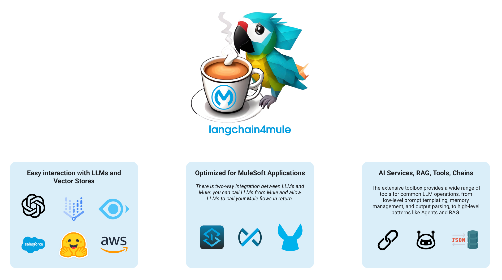
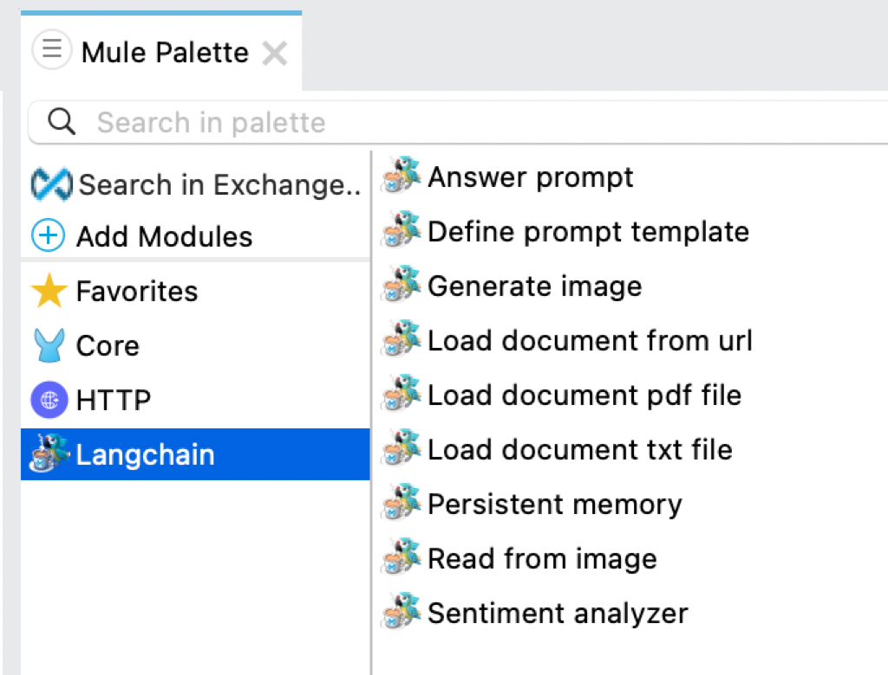

# Langchain Extension for MuleSoft

Langchain4J is used as the base framework for this extension, which integrates Langchain functionalities into MuleSoft applications.

## Overview

This project extends the Mule Palette with a Langchain adapter, allowing users to leverage advanced natural language processing and AI features within MuleSoft flows.

### Base Framework



### Mule Palette Extension



## Features

- **Language Models**: Integrate various language models provided by Langchain to generate text, perform language analysis, and handle complex language-based tasks.
- **Embeddings**: Utilize embedding models to transform text into numerical vectors for tasks such as text similarity, clustering, and search functionalities.
- **Tools Integration**: Incorporate APIs and other dynamic functionalities into MuleSoft, facilitating the use of external services and data processing tools.
- **Image Models**: Work with image models for tasks like image generation, recognition, and manipulation.
- **Streaming**: Support for real-time data processing and interaction with language models.

## Requirements

- The maximum supported version for Java SDK is JDK 17. You can use JDK 17 only for running your application.
- Compilation with Java SDK must be done with JDK 8.

## Installation

To use this connector, add the following dependency to your application's `pom.xml`:

```xml
<dependency>
    <groupId>com.mule.langchain</groupId>
    <artifactId>langchain-connector</artifactId>
    <version>{version}</version>
    <classifier>mule-plugin</classifier>
</dependency>
```

## Getting Started

1.**Clone the Repository**:

```bash
git clone https://github.com/yourusername/langchain4mule.git
cd langchain4mule
```

2. **Set Up Your Development Environment**:

Ensure you have the necessary tools installed, such as JDK 8 and Maven.

3. **Build the Project**:

```bash
mvn clean install
```

## Usage

### Example Mule Flow

Here's an example of how to use the Langchain connector in a Mule flow:

```xml
<flow name="exampleFlow">
    <langchain:config name="Langchain_Config" doc:name="Langchain Config"/>
    <langchain:execute name="Execute_Langchain_Model" doc:name="Execute Langchain Model">
        <langchain:model>exampleModel</langchain:model>
        <langchain:input>Example input text</langchain:input>
    </langchain:execute>
</flow>
```

## Contributing

We welcome contributions to enhance the functionality and features of this connector. Please follow these steps to contribute:

1. **Fork the Repository**:

   Create your own fork of the repository by clicking the "Fork" button at the top right corner of the repository page.

2. **Clone Your Fork**: Clone your forked repository to your local machine.
   ```bash
   git clone https://github.com/yourusername/langchain4mule.git
   cd langchain4mule
   ```
3. **Create a Branch**:

   Create a new branch for your feature or bug fix.

   ```bash
   git checkout -b feature/your-feature-name
   ```

4. **Make your changes**:

   Implement your changes and commit them with a descriptive commit message.

   ```bash
   git add .
   git commit -m "Add your commit message here"
   ```

5. **Push your changes**:

   Push your changes to your forked repository.

   ```bash
   git push origin feature/your-feature-name
   ```

6. **Create a Pull Request**:

   - Go to your forked repository on GitHub.
   - Click the "Compare & pull request" button next to your newly pushed branch.
     Ensure the base fork is **amirkhan-ak-sf/langchain4mule** and the base branch is develop.
   - Provide a clear and descriptive title and description for your pull request, explaining what changes you made and why.
   - Submit the pull request.

7. **Review Process**:

   Your pull request will be reviewed by the maintainers. You might be asked to make additional changes or provide further explanations.
   Once your pull request is approved, it will be merged into the develop branch.

## License

This project is licensed under the MIT License. See the [LICENSE](LICENSE) file for details.

## Contact

For any questions or support, please open an issue on GitHub.
